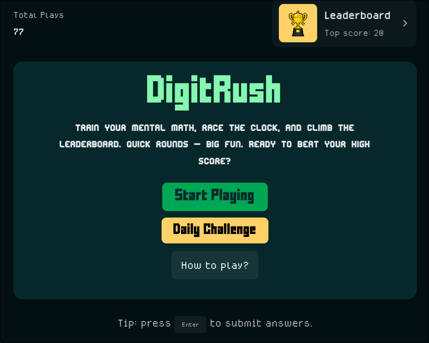

 # DigitRush

**DigitRush** is a lightning-fast mental math challenge game built natively for Reddit using the Devvit platform.



## What is DigitRush?

DigitRush is a mental math gaming platform that runs directly within Reddit posts, in which players can choose between speed challenges or daily competitions, all while competing with real Reddit users on global leaderboards.

### Two Exciting Game Modes

#### **Speed Challenge**
The classic DigitRush experience - an intense 60-second mental math challenge.

#### **Daily Challenge**
Every day brings a new set of 5 carefully crafted problems that all players worldwide attempt to solve as quickly and accurately as possible.

### Reddit-Native Integration
Built exclusively for Reddit's Devvit platform with seamless user integration:
- **Zero Downloads**: Runs directly in Reddit posts - no external apps required
- **Authentic Competition**: Dual leaderboards with real Reddit usernames and avatars
- **Social Sharing**: Native mobile share API with intelligent clipboard fallback for desktop
- **Cross-Subreddit**: Players from different communities compete on unified global leaderboards
- **Persistent Progress**: High scores and daily challenge completions saved across sessions with Redis backend

### 🧮 Math Problem Types

DigitRush generates four types of arithmetic problems with carefully balanced difficulty:

| Operation | Format | Range | Examples | Difficulty |
|-----------|--------|-------|----------|------------|
| **Addition** | `A + B = ?` | 10-99 + 10-99 | `47 + 83`, `25 + 56` | Moderate |
| **Subtraction** | `A - B = ?` | 20-99 - 10 to (A-1) | `74 - 29`, `85 - 47` | Moderate |
| **Multiplication** | `A × B = ?` | 2-20 × 2-10 | `7 × 8`, `15 × 6` | Moderate-Hard |
| **Division** | `A ÷ B = ?` | Clean division, divisors 2-11 | `84 ÷ 7`, `132 ÷ 11` | Moderate-Hard |

For more deatails of the project, see [DOCUMENTATION.md](DOCUMENTATION.md).

## Development

### Quick Start
```bash
git clone https://github.com/crypticsaiyan/DigitRush.git
cd DigitRush
npm ci
npm run dev
```

### Project Structure
```
src/
├── client/                    # React frontend with TypeScript
│   ├── components/           # Game screens and UI components
│   │   ├── StartPage.tsx     # Main menu with mode selection
│   │   ├── GamePlay.tsx      # Speed Challenge gameplay
│   │   ├── GameResults.tsx   # Speed Challenge results & sharing
│   │   ├── Leaderboard.tsx   # Speed Challenge leaderboard
│   │   ├── DailyChallenge.tsx        # Daily Challenge router
│   │   ├── DailyChallengeMenu.tsx    # Daily Challenge menu/results
│   │   ├── DailyChallengePlay.tsx    # Daily Challenge gameplay
│   │   ├── DailyChallengeLeaderboard.tsx # Daily Challenge leaderboard
│   │   └── index.ts          # Component exports
│   ├── hooks/               # Custom React hooks
│   │   ├── useMathGame.ts   # Speed Challenge state management
│   │   ├── useDailyChallenge.ts # Daily Challenge state management
│   │   ├── useAssetPreloader.ts # Asset loading
│   │   └── useCounter.ts    # Counter utilities
│   ├── public/              # Static assets
│   │   ├── fonts/           # Custom fonts (FFFFORWA, Medodica, EditUndo)
│   │   └── images/          # Game assets (medals, trophy.gif, etc.)
│   ├── App.tsx              # Main app component with mode routing
│   ├── main.tsx             # React entry point
│   ├── index.html           # HTML template
│   └── index.css            # Global styles and animations
├── server/                  # Express API with Devvit integration
│   ├── core/               # Business logic modules
│   │   └── post.ts         # Reddit post creation
│   └── index.ts            # API endpoints and server logic
└── shared/                 # Shared types and constants
    ├── types/              # TypeScript type definitions
    │   └── api.ts          # API request/response types
    └── constants.ts        # Game configuration constants
```

### Configuration
Easily customize game parameters:

```typescript
// src/shared/constants.ts
export const GAME_DURATION_SECONDS = 60;              // Speed Challenge duration
export const LOW_TIME_THRESHOLD = 10;                 // Warning threshold (red progress bar)
export const DAILY_CHALLENGE_PROBLEMS_COUNT = 5;      // Daily Challenge problem count
export const ALLOW_DAILY_RETRIES_FOR_TESTING = false; // Enable replay for development
```

### Commands
```bash
npm run dev        # Development server with hot reloading
npm run build      # Build for production
npm run deploy     # Deploy to Reddit using Devvit
npm run launch     # Publish for review on Reddit
```

## License

BSD-3-Clause